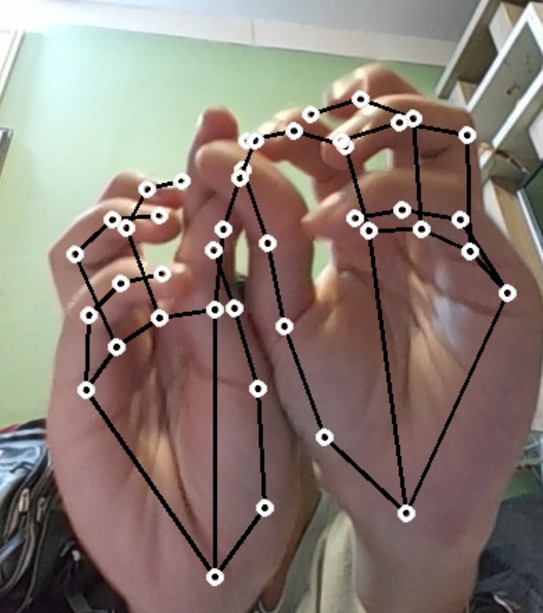

# Real-Time Hand Tracking with MediaPipe

This project demonstrates real-time hand tracking using Python, OpenCV, and MediaPipe. It captures video from your webcam, detects hand landmarks, and saves annotated images every 5 seconds to an "Output Images" directory.

## Features

- Real-time hand detection and landmark visualization
- Automatic image saving every 5 seconds
- Clean visualization of hand landmarks and connections
- Cross-platform compatibility (Windows, macOS, Linux)

## Demo

  

  
 


## Requirements

- Python 3.7+
- OpenCV (cv2)
- MediaPipe
- UUID library

## Installation

1. Clone this repository or download the script
2. Install the required packages:

    ```bash
    pip install opencv-python mediapipe uuid

## Usage

1.Run the script:

    ```bash
    python hand_tracking.py

2.2 The application will:

Open a window showing your webcam feed with hand landmarks

Create an "Output Images" directory if it doesn't exist

Save annotated images every 5 seconds with unique filenames

Controls:

Press 'q' to quit the application

Close the window to exit

Output:
The script saves images in the "Output Images" directory with names like: 
2a4f6b80-b5a1-11ed-9b6a-0242ac120002.jpg

-> Each image shows:

Detected hand landmarks (white circles)

Connections between landmarks (black lines)

## Customization

You can modify these parameters in the code:

save_interval: Change the number (in seconds) between image saves

Visualization colors: Adjust the colors of landmarks and connections

Camera selection: Change the 0 in cv2.VideoCapture(0) to use a different camera


## Troubleshooting

If no camera feed appears:

Check your webcam is connected and working

Try changing the camera index in cv2.VideoCapture()

If you get import errors:

Verify all packages are installed correctly

Check your Python version (requires 3.7+)

## License
This project is open source and available under the MIT License.

## Acknowledgments
Uses MediaPipe for hand tracking

Built with OpenCV for computer vision operations


